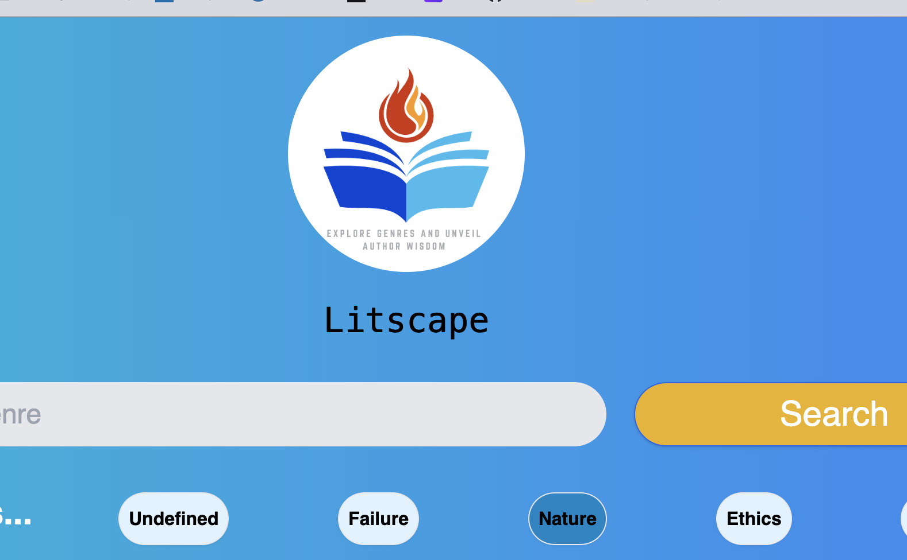

# 📖 LitScape

## Deployment Screenshot

# Pitch
Great influencers and communicators, need to accent and enhance their communication with the weight of great works and minds. Litscape quickly connects communicators with the quotes to accentuate their communication, whether email or socail media.

# Description
LitScape that allows the user to search via genre to access a list of quotes from famous authors. These can be easily copied out and used in text or social media.  

# Technology

## API's:
### Website is built using 2 api's
- Quotable at https://github.com/lukePeavey/quotable
-- for quotes attributed to author, for list of genres.
- Open Library at https://openlibrary.org/
-- for information about certain books
-- for images of authors

## Front End
### HTML, JQuery Javascript and Tailwind CSS library
Tailwind was selected as an alternative to bootstrap. Tailwind appears polished and is well documented, however appears to favour purchase or subscription based access to its components. 

## Back End
### Async Fetch()
Calls to the Quotable API are done using ASYNC AWAIT fetch calls to API. 

### Local Storage
The results of all requests are stored in localstorage. User settings are also stored in local storage.

# USER STORY

GIVEN a website that can search via genre.
WHEN I open the website I am presented with the site title and a search bar.
THEN I enter a genre into the search bar.

WHEN I click search, 
THEN a list of authors cards from the corresponding genre appear below the search bar. Each author has a list of quotes attributed to them below thier name.

WHEN I view an author
THEN I is see their name and below their name a list of quotes attrbuted to them.

//Later
WHEN I click on a specific book, information about the book such as Author, Date Published and Pages long is displayed.
THEN if the author's name is clicked, below their name a famous quote of theirs pops up.

